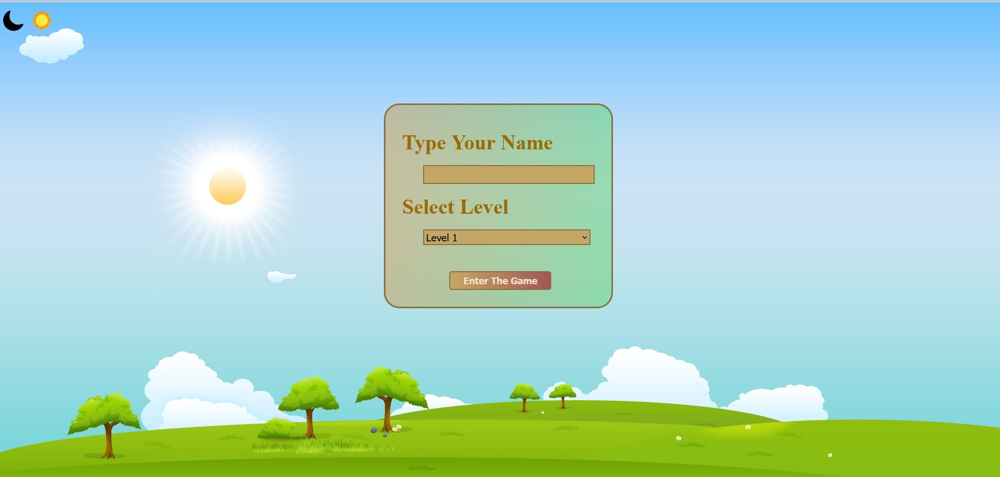
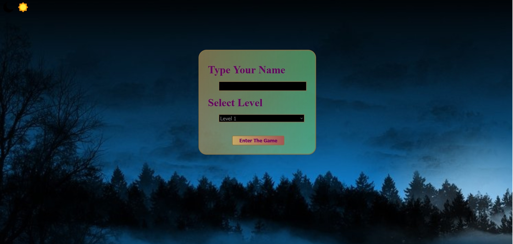
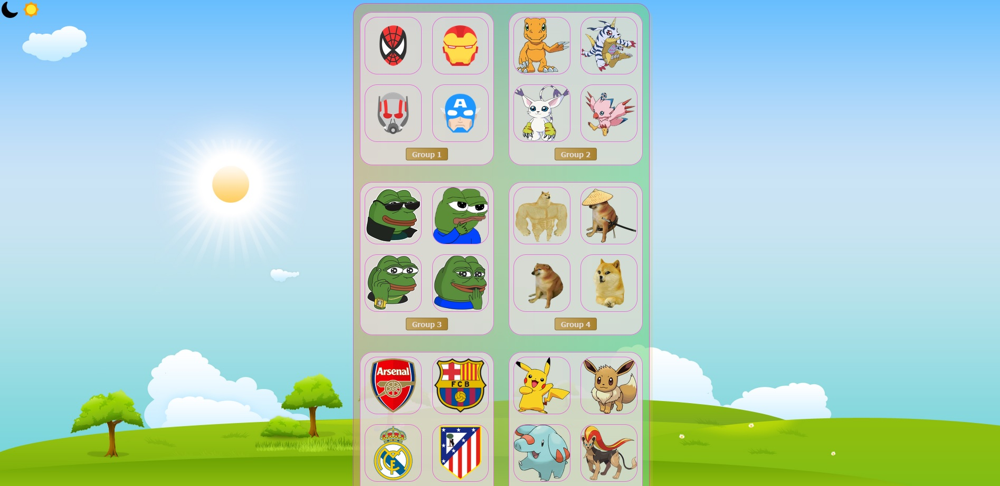
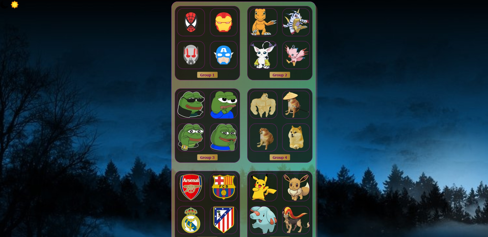
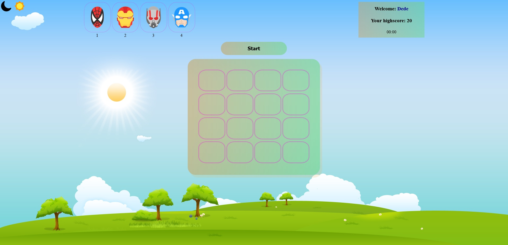
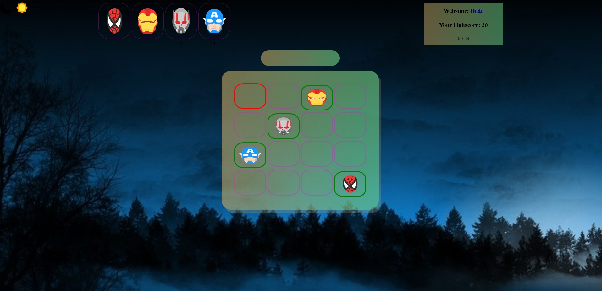
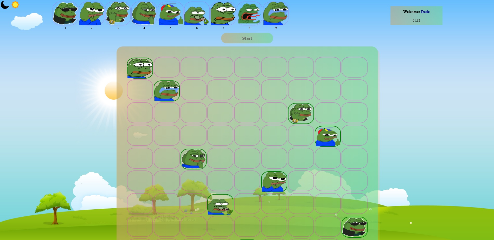
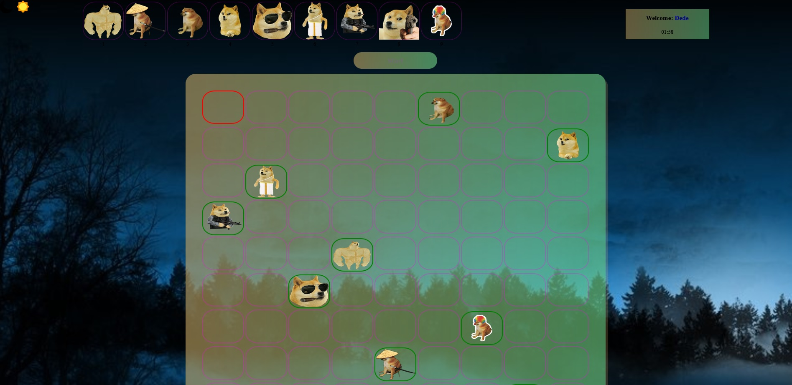
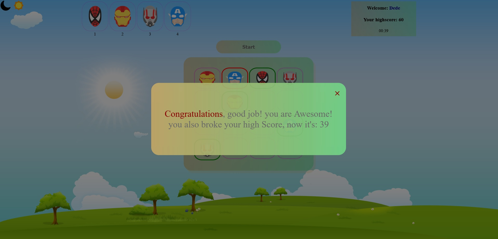
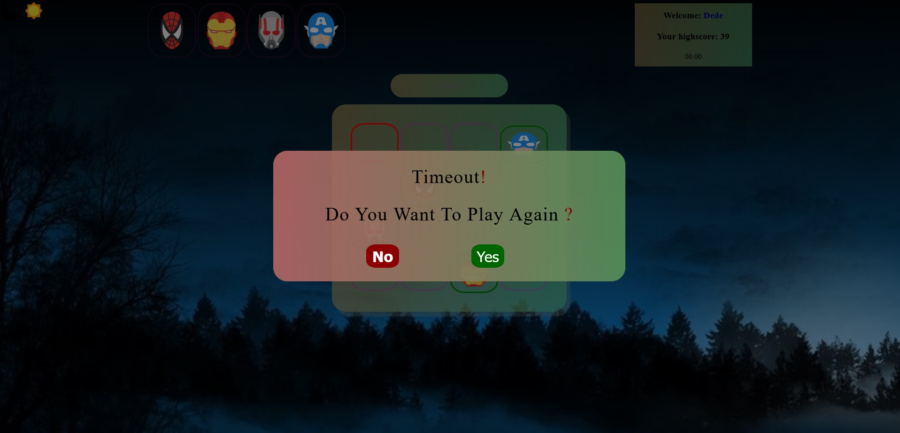

# JavaScript-Sudoku

ITI intake 42 OpenSource Application development JavaScript Project; creating a sudoku game for kids.

## How to play?

You can start by downloading the project and running the "login-page.html" file **using a server**.

# Definition of the game:

The game is designed for kids to play a more fun and interactive sudoku.

# Specifications:

The game takes your name and level and either saves it to the localStorage or compare it to the info already there, if the later is true, then we display your highest score to you just below the name on the game page.

the game contains a dark mode theme; you can choose it by clicking on the half moon icon at the top left of any page; your choice carries over all pages, and you can switch back by clicking on the sun icon at the top left.

going into the game page, the group's pictures are displayed at the top, the grid is constructed dynamically depending on if you chose Level 1(4X4) or Level 2(9X9).

clicking on start, the images are selected randomly, and distributed randomly throughout the grid, following three rules:

1. each row has one picture.
2. and each column also has one picture.
3. no repeated pictures.

upon winning the game, an alert will be displayed, congratulating you and informing you of your high score and either you broke it and now you have a new high score; high score is tracked seperately for each level and each player (using localStorage).

if you weren't able to win until time ran out, there will be a message informing you of the time out and you aren't able to continue.

after either winning or losing, an alert will be displayed, asking you if you would like to play another game or going back to the login page.

# Description of the game:

1- running login-page, you enter your username and choose the game level:

- Level 1 contains 4x4 grid, the game timer is 60 seconds.
- Level 2 is 9x9 grid with 2 minutes timer.

2- Then, you choose from six groups of figures. each group containing different figures that you can use to play with.

3- Finally, you can start playing by pressing on the **start** button. you can choose the figure you want to select by:

- Choose the cell you want to insert the firgure in by the keyboard arrows.
- After selecting the cell, you can choose the figure by clicking the number under the figure you wish to choose.

# Snapshots:

### Login page:

 

### Choosing groups:

 

### Gameplay:

 

 

 

# Contributing and changing:

Pull requests are welcome. For major changes, please open an issue first to discuss what you would like to change.

Please make sure to update tests as appropriate.

Incase you want to change the pictures, you're welcome to change the images in each group, make sure each image is of a PNG extention, and it's counter from 1 to 9 for each group; each group name has to be Group# (the numbers being from 1 to 6) **i.e : create folder called Group1 with pictures inside being called 1.png to 9.png**
